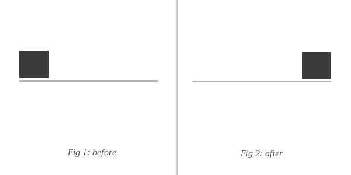

## Moving things from one place to another.

<p align="center">
  
</p>

### Purpose

Purposely, the goal of this repository is to organize things to make them fit the way they have to be fitted.
Two people need to move things from a place (more precisely: two places) to another completely different place.
This repo is about making things work out by matching tasks to be done with people who agree to do them.

### Syntax

```
 #team<int>   Team name, index matches /[1-4]/
 #p<int>      Place name, index matches /[1-4]/
 !J           Person 1 who want things to be moved
 !M           Person 2 who want things to be moved
 !<int>       People helping to move things. Index matches /[a-Z]*/
               See "People matching" section below
```

### Places

```
 #p1  Place where !J lives
 #p2  Place where !M lives
 #p3  Place where !P and !Y live (and where !J and !M will live)
```

### Initial teams

```
 #team1  !J, !H
 #team2  !M, !B
 #team3  !R, !Mie
 #team4  !P, !Y
 #team5  !F
```

### Map of actions, indexed by timestamp

<table>
  <thead>
    <tr>
      <th></th>
      <th><code>#team1</code></th>
      <th><code>#team2</code></th>
      <th><code>#team3</code></th>
      <th><code>#team4</code></th>
    </tr>
  </thead>
  <tbody>

    <tr>
      <td>
        <code>09:00</code>
      </td>
      <td>
        <code>#p1</code> :flushed:
      </td>
      <td>
        <code>#p2</code> :flushed:
      </td>
      <td>
        <code>#p3</code> :sleeping:
      </td>
      <td>
        <code>#p4</code> :sleeping:
      </td>
    </tr>

    <tr>
      <td>
        <code>10:00</code>
      </td>
      <td>
        :car:
      </td>
      <td>
        <code>#p2</code> :package: :arrow_down:
      </td>
      <td>
        <code>#p3</code> :flushed:
      </td>
      <td>
        <code>#p4</code> :flushed:
      </td>
    </tr>

    <tr>
      <td>
        <code>11:00</code>
      </td>
      <td>
        <code>#p2</code> :package: :arrow_right:
      </td>
      <td>
        <code>#p2</code> :package: :arrow_right:
      </td>
      <td>
        :trolleybus:
      </td>
      <td>
        <code>#p4</code> :no_mouth:
      </td>
    </tr>

    <tr>
      <td align="center">
        :arrows_counterclockwise:
      </td>
      <td colspan="4" align="center">
        <strong>!M</strong> switches from <strong>#team2</strong> to <strong>#team1</strong><br>
        <strong>!J</strong> switches from <strong>#team1</strong> to <strong>#team2</strong> and take the :bus: to go in <code>#p1</code>
      </td>
    </tr>

    <tr>
      <td>
        <code>12:00</code>
      </td>
      <td>
        :car:
      </td>
      <td>
        <code>#p1</code> :package: :arrow_down:
      </td>
      <td>
        <code>#p1</code> :package: :arrow_down:
      </td>
      <td>
        <code>#p4</code> :no_mouth:
      </td>
    </tr>

    <tr>
      <td>
        <code>12:30</code>
      </td>
      <td>
        <code>#p4</code> :package: :arrow_up:
      </td>
      <td>
        <code>#p1</code> :package: :arrow_down:
      </td>
      <td>
        <code>#p1</code> :package: :arrow_down:
      </td>
      <td>
        <code>#p4</code> :package: :arrow_up:
      </td>
    </tr>

    <tr>
      <td>
        <code>13:00</code>
      </td>
      <td>
      </td>
      <td>
      </td>
      <td>
      </td>
      <td>
      </td>
    </tr>

    <tr>
      <td>
        <code>14:00</code>
      </td>
      <td>
      </td>
      <td>
      </td>
      <td>
      </td>
      <td>
      </td>
    </tr>

    <tr>
      <td>
        <code>15:00</code>
      </td>
      <td>
      </td>
      <td>
      </td>
      <td>
      </td>
      <td>
      </td>
    </tr>

    <tr>
      <td>
        <code>16:00</code>
      </td>
      <td>
      </td>
      <td>
      </td>
      <td>
      </td>
      <td>
      </td>
    </tr>

    <tr>
      <td>
        <code>17:00</code>
      </td>
      <td>
      </td>
      <td>
      </td>
      <td>
      </td>
      <td>
      </td>
    </tr>

    <tr>
      <td>
        <code>18:00</code>
      </td>
      <td>
      </td>
      <td>
      </td>
      <td>
      </td>
      <td>
      </td>
    </tr>

    <tr>
      <td>
        <code>19:00</code>
      </td>
      <td>
      </td>
      <td>
      </td>
      <td>
      </td>
      <td>
      </td>
    </tr>

  </tbody>
</table>

### Earnings

Each participant gets **5 Yolopoints™** that can be used to buy food & drink during the day.
Additional **Yolopoints™** can be earned by accomplishing some particular tasks, and according to the difficulty of the given missions.

<table>
  <thead>
    <tr>
      <th align="left">Product</th>
      <th align="left">Cost in Yolopoints™</th>
    </tr>
  </thead>
  <tbody>
    <tr>
      <td colspan="2" align="center" style="background: #666; color: white">
        :tropical_drink: <strong>Drinks</strong>
      </td>
    </tr>
    <tr>
      <td>Water bottle</td>
      <td align="center"><strong>0.5</strong></td>
    </tr>
    <tr>
      <td>Basic soda (including Coca Cola, Fanta, etc.)</td>
      <td align="center"><strong>1</strong></td>
    </tr>
    <tr>
      <td>Orangina</td>
      <td align="center"><strong>1.5</strong></td>
    </tr>
    <tr>
      <td>Beer</td>
      <td align="center"><strong>2</strong></td>
    </tr>

    <tr>
      <td colspan="2" align="center" style="background: #666; color: white">
        :hamburger: <strong>Food</strong>
      </td>
    </tr>
    <tr>
      <td>Simple bread</td>
      <td align="center"><strong>0.5</strong></td>
    </tr>
    <tr>
      <td>Bag of chips (including flavored)</td>
      <td align="center"><strong>1</strong></td>
    </tr>
    <tr>
      <td>Pringles</td>
      <td align="center"><strong>2</strong></td>
    </tr>
    <tr>
      <td>Triangular sandwich (including <em>Hallal</em>)</td>
      <td align="center"><strong>2</strong></td>
    </tr>
    <tr>
      <td>Pasta box (cold)</td>
      <td align="center"><strong>3</strong></td>
    </tr>
    <tr>
      <td>Sushis</td>
      <td align="center"><strong>6</strong></td>
    </tr>

  </tbody>
</table>
